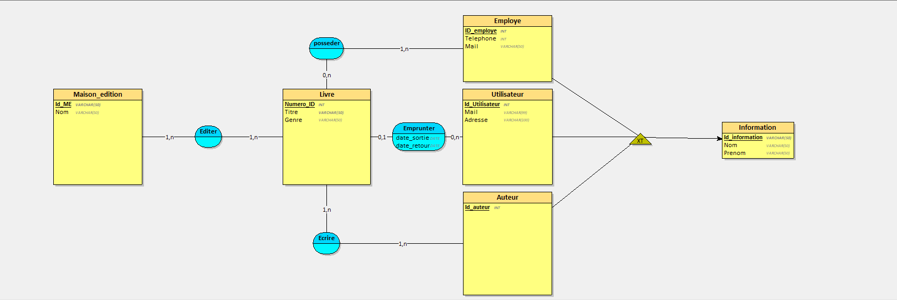

## MCD



## MLD


Livre = (Numero_ID INT, Titre VARCHAR(50), Genre VARCHAR(50));<br>
Information = (Id_information VARCHAR(50), Nom VARCHAR(50), Prenom VARCHAR(50));<br>
Maison_edition = (Id_ME VARCHAR(50), Nom VARCHAR(50));<br>
Utilisateur = (Id_Utilisateur INT, Mail VARCHAR(99), Adresse VARCHAR(100), #Id_information);<br>
Employe = (ID_employe INT, Telephone INT, Mail VARCHAR(50), #Id_information);<br>
Auteur = (Id_auteur INT, #Id_information);<br>
Emprunter = (#Numero_ID, date_sortie DATE, date_retour DATE, #Id_Utilisateur);<br>
posseder = (#Numero_ID, #ID_employe);<br>
Ecrire = (#Numero_ID, #Id_auteur);<br>
Editer = (#Numero_ID, #Id_ME);<br>


## SCRIPT SQL

```sql
CREATE TABLE Livre(
   Numero_ID INT,
   Titre VARCHAR(50) NOT NULL,
   Genre VARCHAR(50),
   PRIMARY KEY(Numero_ID)
);

CREATE TABLE Information(
   Id_information VARCHAR(50),
   Nom VARCHAR(50),
   Prenom VARCHAR(50),
   PRIMARY KEY(Id_information)
);

CREATE TABLE Maison_edition(
   Id_ME VARCHAR(50),
   Nom VARCHAR(50),
   PRIMARY KEY(Id_ME)
);

CREATE TABLE Utilisateur(
   Id_Utilisateur INT,
   Mail VARCHAR(99),
   Adresse VARCHAR(100),
   Id_information VARCHAR(50) NOT NULL,
   PRIMARY KEY(Id_Utilisateur),
   UNIQUE(Id_information),
   FOREIGN KEY(Id_information) REFERENCES Information(Id_information)
);

CREATE TABLE Employe(
   ID_employe INT,
   Telephone INT,
   Mail VARCHAR(50),
   Id_information VARCHAR(50) NOT NULL,
   PRIMARY KEY(ID_employe),
   UNIQUE(Id_information),
   FOREIGN KEY(Id_information) REFERENCES Information(Id_information)
);

CREATE TABLE Auteur(
   Id_auteur INT,
   Id_information VARCHAR(50) NOT NULL,
   PRIMARY KEY(Id_auteur),
   UNIQUE(Id_information),
   FOREIGN KEY(Id_information) REFERENCES Information(Id_information)
);

CREATE TABLE Emprunter(
   Numero_ID INT,
   date_sortie DATE,
   date_retour DATE,
   Id_Utilisateur INT NOT NULL,
   PRIMARY KEY(Numero_ID),
   FOREIGN KEY(Numero_ID) REFERENCES Livre(Numero_ID),
   FOREIGN KEY(Id_Utilisateur) REFERENCES Utilisateur(Id_Utilisateur)
);

CREATE TABLE posseder(
   Numero_ID INT,
   ID_employe INT,
   PRIMARY KEY(Numero_ID, ID_employe),
   FOREIGN KEY(Numero_ID) REFERENCES Livre(Numero_ID),
   FOREIGN KEY(ID_employe) REFERENCES Employe(ID_employe)
);

CREATE TABLE Ecrire(
   Numero_ID INT,
   Id_auteur INT,
   PRIMARY KEY(Numero_ID, Id_auteur),
   FOREIGN KEY(Numero_ID) REFERENCES Livre(Numero_ID),
   FOREIGN KEY(Id_auteur) REFERENCES Auteur(Id_auteur)
);

CREATE TABLE Editer(
   Numero_ID INT,
   Id_ME VARCHAR(50),
   PRIMARY KEY(Numero_ID, Id_ME),
   FOREIGN KEY(Numero_ID) REFERENCES Livre(Numero_ID),
   FOREIGN KEY(Id_ME) REFERENCES Maison_edition(Id_ME)
);
```